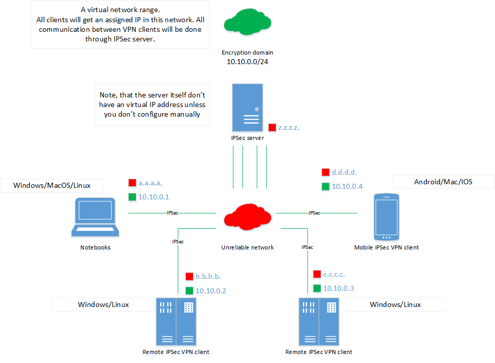

# Full IPSec installation Ansible Role




## Requirements

### Operation systems
The role was tested on:
- CentOS 7

It may be even possible to run the role on the other distributives, but you would have to adopt file path in the role's variables files.


## Abstract

IPSec IKEv2 methods supported:
- EAP with certificates
- EAP-TTLS (with EAP-RADIUS as phase 2)

The role is intended to run against Linux-based machines, to install credentials on MacOS/Windows/Android see [link](https://www.strongswan.org/docs/dfn_berlin_2011.pdf). `Strongswan` is intended to use as IKE keyring daemon. It will establish a policy-based VPN connection (difference between interface-based and policy-based VPN see [here](http://www.internet-computer-security.com/VPN-Guide/Policy-based-vs-Route-based-VPN.html) or [here](https://www.juniper.net/documentation/en_US/release-independent/nce/topics/concept/policy-based-route-based-vpn-comparing.html)).

This role will create a Certificate Authority center (CA), a running IPSec linux server, install packages on clients' machines, automatically deploy all necessary certificates and up connections.

By default, IKEv2-TLS with certificates is used, you may change the behavior by choosing a specific EAP-* method (see [this](https://wiki.strongswan.org/projects/strongswan/wiki/IKEv2Examples) link) and manually change the configuration files.

For Ansible role you must either change hosts' names in the playbooks or make sure you have configured specified host groups in your inventory (e.g. `/etc/ansible/hosts`):

- `[ca]` - should contains a one record to point the address of CA. There will be stored all PKI information. The host with CA role can be also used for `[ipsec]`, but this could leak to security issues.
- `[ipsec]` - a main server where all clients will connect to. Also is supposed to be a single role.
- `[clients]` - a list of linux machines where the role will automatically install and configure the connection. That can be useful if you'd like to secure your server infrastructure. All credentials will be automatically deployed, for this purpose check you configured user-cred mapping properly in `IPSEC_USER_MAPPING` variable.

After you have configured your inventory, then tailor the configuration files.

### Configuration files
If you want to adapt the default settings then it's free for you to change the following files:

- `config/vars.yaml` - used for common settings, to share the main options between different roles.
- `config/ca.yaml` - contains information for local Certificate Authority used to apply PKI's power.
- `config/server.yaml` - contains information for IPSec server installation. Highly recommended to change for the specific case.
- `config/users.yaml` -  contains information for customer's PKI credentials. You can add any amount of users, credentials for all of them would be automatically generated and stored on your host machine.
- `config/radius.yaml` - contains information for connection to a RADIUS server.

If you want to change Certificate Authority:
- `CA_FQDN` - FQDN for CA. Can be not used, but the zone name should be along with ipsec FQDN;
- `CA_DN` - a string to describe the authority;
- `CA_KEY_NAME` - a convenient name for CA private key file;
- `CA_CERT_NAME` - a convenient name for CA certificate file.

For the right working VPN network, the obligatory settings are:
- `IPSEC_IP` - the actual external IP address of VPN server;
- `IPSEC_FQDN` - the FQDN name which will be used as Identity;
- `IPSEC_FQDN` - a string to describe the IPSec server;
- `IPSEC_ENCRYPTION_DOMAIN` - a virtual IP pool each VPN client will lease from;
- `IPSEC_ADVERTISE_DOMAIN` - a set of routes which will be advertised for VPN clients;
- `IPSEC_ADVERTISE_DNS` - a set of DNS servers server will use in the VPN connection;
- `IPSEC_USERS` - the list of users;
- `IPSEC_USER_MAPPING` - the mapping between users' credentials and automatically configured hosts;
- `IPSEC_KEY_NAME` - a convenient name for IPSec server private key file;
- `IPSEC_CERT_NAME` - a convenient name for IPSec server certificate file.


If you want to use a RADIUS server for AAA, then you should change the following parameters (the RADIUS server should be already configured to use the same secrets and to know this RADIUS client):
- `RADIUS_IPADDR` - the actual address of  RADIUS server;
- `RADIUS_SECRET` - shared secret between the server and the client;
- `RADIUS_NAS_NAME` - short name for RADIUS server;
- 'RADIUS_IPSEC_NAME' - short name for the current client.


## Usage

### Prepare inventory

Example of inventory file:

```yaml

[ca]
192.168.13.13

[ipsec]
192.168.13.13
192.168.13.14

[clients]
192.168.13.2
10.10.0.1
10.10.0.2
```

### Run the role

If you have done properly, then it's easy to run the playbook by typing:
```bash
ansible-playbook -i inventory.yaml main.yaml
```

or you can run each step manually:

```bash
# Deploy CA
ansible-playbook -i inventory.yaml playbooks/init_ca.yaml

# Deploy Strongswan
ansible-playbook -i inventory.yaml playbooks/init_ipsec.yaml

# Create certificates and private keys for users
ansible-playbook -i inventory.yaml playbooks/init_users.yaml

# Deliver credentials and install Strongswan on clients if it is necessary
ansible-playbook -i inventory.yaml playbooks/init_conn.yaml
```

Your user should be able to execute command under **root**. If your ansible user is in *wheel* \ *sudo* group, then just a slight modification is enough:

```bash
ansible-playbook -i inventory.yaml main.yaml --become
```

### Change Configuration

If you need just to reconfigure in your IPSec configuration via changes in templates and variables, you can run this playbook:

```bash
# Update configuration for IPSec servers
ansible-playbook -i inventory.yaml playbooks/deploy_conf.yaml
```
